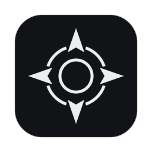
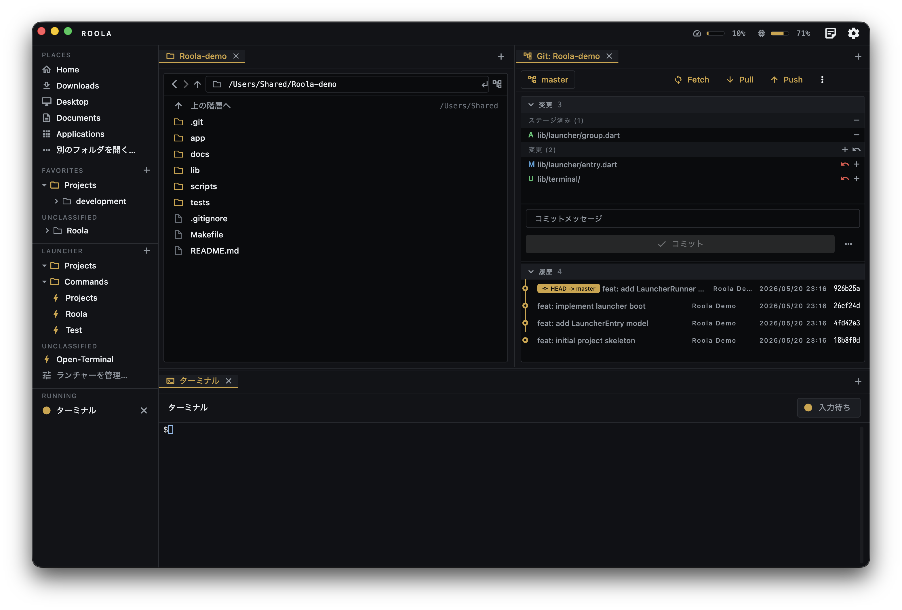
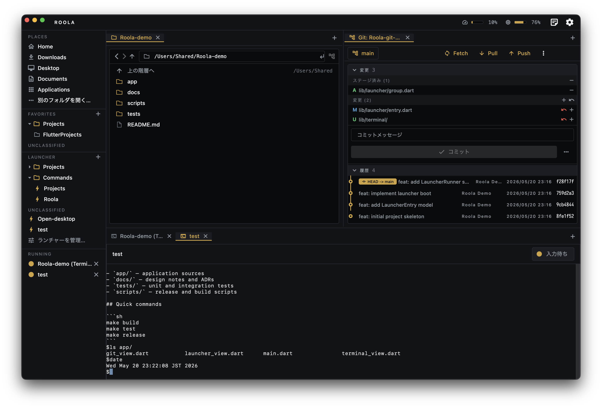
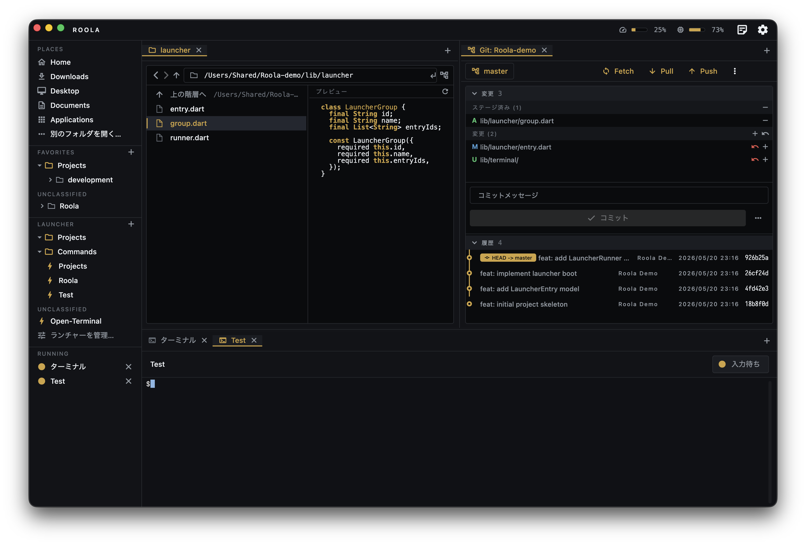
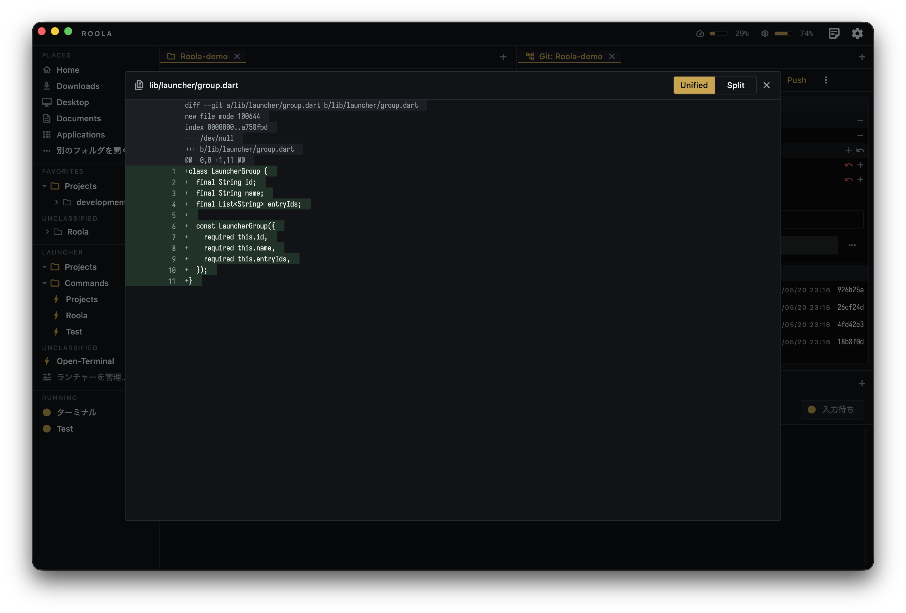

<p align="center">
  
</p>

<h1 align="center">Roola</h1>

<p align="center">
  <strong>For Developers.</strong><br>
  目的地へ、一瞬で。ファイル・ターミナル・Claude Code を 1 つに束ねる、開発者のための macOS ファイルエクスプローラ。
</p>

<p align="center">
  <a href="./LICENSE"></a>
  
  
</p>

> Compatible with [Claude Code](https://docs.claude.com/claude-code) — インストール済みなら Skill 実行・対話セッション起動などの統合 UI が自動で有効化されます。インストールされていなくても汎用ランチャーとして動きます（ADR-0016 / ADR-0022）。



---

## Overview (English)

**Roola** is a file explorer built for developers on macOS. Browse your filesystem and
reach your destinations instantly — open a shell, run an arbitrary command, or launch a
**Claude Code** skill with one click, all scoped to a directory and running inside a
built-in PTY terminal. Register frequently-used **"directory + action"** pairs once, then
launch them from the sidebar.

### Highlights

- **3-pane tabbed workspace** — Explorer / Terminal / Git tabs, freely arranged across
  three panes. Per-tab state, layout restored on relaunch.
- **One-click launchers** — open a shell, run an arbitrary command, or invoke a
  Claude Code skill, all scoped to a chosen directory. Group launchers into folders.
- **Native PTY terminal** — backed by SwiftTerm. `Shift+Enter` inputs a literal newline
  for multi-line prompts.
- **Built-in Git view** — diff / history / branches / stash, as a workspace tab.
- **Read-only file preview** — select a file to preview it in a side pane: syntax-highlighted
  code, images, or PDF. Hidden by default; opens automatically for previewable files.
- **Keyboard-driven explorer** — arrow keys to move the selection, `Enter` to open,
  `→` / `←` to descend / go up.
- **Floating notepad, CPU/memory monitor, customizable keybindings, multi-window.**
- **Task completion notifications** — get a macOS notification when a Claude Code
  session launched from Roola finishes a turn, via a Stop hook you add to your Claude
  settings (ADR-0057).
- **Polaris design system** — dark-only, single accent (warm gold or ice blue),
  function-first aesthetic. No light theme.
- **Optional Claude Code integration** — when [Claude Code](https://docs.claude.com/claude-code)
  is installed, Roola auto-enables skill detection, one-click skill launch, and a
  `claude --version` healthcheck banner. Roola is **not** an official Claude / Anthropic
  product.

### Install

Download the latest signed & notarized DMG from the
[Releases](https://github.com/yahir0/Roola/releases) page, drag `Roola.app` into
`Applications`, and launch from Launchpad or Spotlight. Auto-update is handled by
[Sparkle](https://sparkle-project.org/).

Requires **macOS 14 (Sonoma) or later**. Apple Silicon & Intel supported.

License: [MIT](./LICENSE).

> The detailed documentation below is in Japanese. For architecture notes and design
> decisions in English-readable form, see [`docs/`](./docs/) (mixed JP/EN).

---

## Quick Start

1. **DMG をダウンロード**: [Releases](https://github.com/yahir0/Roola/releases) ページから最新版を取得（公証 + ステープリング済み）。
2. **インストール**: DMG を開いて `Roola.app` を `Applications` フォルダにドラッグ。
3. **起動**: Launchpad もしくは Spotlight から `Roola` で起動。

> 自分でビルドしたい場合は [Build from source](#build-from-source) を参照。

## 主な機能

- **3 ペインタブ式ワークスペース** — Explorer / Terminal / Git の 3 タイプのタブを 3 ペインに自由配置（ADR-0026）。タブ単位で per-tab 状態を保持し、再起動でレイアウトを復元（ADR-0028）。
- **ファイルエクスプローラ** — ローカルディレクトリをブラウズ、ダブルクリックで遷移、十字キー / Enter でも操作（ADR-0051）、お気に入り・Cmd+C でパスコピー（ADR-0021）。`.claude/skills/` を検知して特別アイコン化。
- **ファイルプレビュー** — ファイルを選択すると右ペインに読み取り専用プレビューを表示。コード（シンタックスハイライト）/ 画像 / PDF に対応（ADR-0046 / 0050）。既定は非表示で、プレビュー可能なファイルの選択で自動的に開閉する。
- **ワンクリック・ランチャー** — 「ディレクトリ + 動作」を登録し、サイドバーからワンタップで起動。フォルダで 1 階層グルーピング可（ADR-0019 / 0029）。
- **アプリ内 PTY ターミナル** — SwiftTerm ネイティブビューによる高速描画（ADR-0031）。Shift+Enter で改行入力（ADR-0032）。
- **Git ビュー** — Diff / コミット履歴 / ブランチ操作・stash をワークスペースタブとして提供（ADR-0030）。
- **ノートパッド** — ワークスペース外のフローティングパネル。トップバーのメモアイコンから開閉（ADR-0036）。
- **アクティビティモニタ** — トップバーに CPU / メモリの占有率をミニゲージ表示。クリックで上位プロセス一覧（ADR-0039）。
- **カスタマイズ可能なキーボードショートカット** — コマンドレジストリ + ネイティブメニューバーによる統一機構（ADR-0033）。
- **多言語化** — 日本語 / 英語（Flutter 公式 gen-l10n、ADR-0034）。
- **Polaris デザインシステム** — ダーク専用・機能主義のオリジナルデザイン（ADR-0038）。アクセント色は暖色ゴールド / アイスブルーの 2 択。
- **外観モード** — 透過 / 不透明 の 2 モードを切替。
- **マルチウィンドウ** — メニューバー「ファイル → 新規ウィンドウ」または Dock 右クリックから別プロセスを起動（ADR-0012）。
- **Compatible with Claude Code** — インストール時に Skill 検出・対話セッション起動・ヘルスチェック等の統合 UI が有効化（[詳細](#compatible-with-claude-code)）。
- **タスク完了通知** — Roola で起動した Claude Code がターンを完了して入力待ちに戻ると macOS 通知で知らせる。Claude Code の Stop フックを `~/.claude/settings.json` に登録して使う（ADR-0057）。

## 動作環境

- macOS 14（Sonoma）以降を推奨（Apple Silicon / Intel）
- Claude Code CLI は **オプション**（[公式ガイド](https://docs.claude.com/claude-code)）

## Build from source

開発 / カスタムビルド用。配布版を使うだけなら不要です。

```bash
# 初回セットアップ（pub get + build_runner でコード生成）
make setup

# 起動（Debug ビルド、bundle ID は dev.tech.yahiro.Roola）
make run

# 配布用 DMG をビルド（要: Developer ID Application 証明書 + notarytool プロファイル）
make dist SIGN_IDENTITY="Developer ID Application: NAME (TEAMID)" \
          NOTARY_PROFILE=your-notary-profile
```

`make` を使わない同等コマンド:

```bash
flutter pub get
dart run build_runner build
flutter run -d macos --dart-define-from-file=dart_defines/prod.json
```

FVM 利用時は `make run FLUTTER="fvm flutter" DART="fvm dart"` のように上書き。`make help` で全ターゲット一覧。

## 使い方

### 初回起動

アプリを起動するとワークスペース（Explorer タブ）が開きます。左側にお気に入り・ランチャーのサイドバー、中央にタブ式の 3 ペイン、トップバーにアクティビティモニタ・ノートパッド・設定があります。

### ランチャーにエントリを登録する

サイドバーの「ランチャー」セクション右端の「+」または「管理…」リンクから登録画面を開きます。動作タイプは 3 種類:

| 動作タイプ | 用途 |
|---|---|
| **シェルを開く** | `$SHELL` を対象ディレクトリで起動（コマンドなし） |
| **コマンドを実行** | 任意コマンドを `$SHELL -ilc` 経由で実行。`.zshrc` の PATH を継承するので pnpm / nvm / Homebrew 配下のツールもそのまま動く。完了後にシェルを継続させるオプションあり |
| **Claude Code Skill** | `claude /<skill-name>` を起動。Skill 名を指定。Claude Code CLI がインストールされていないと選択肢自体が出ません |

登録済みエントリは 1 階層のフォルダでグルーピング可能。ランチャー管理画面でドラッグ & ドロップで整理できます。

### エントリを起動する

サイドバーのエントリをクリックすると PTY セッションが立ち上がり、ワークスペースのターミナルタブに表示されます。状態遷移:

`起動中…` → `実行中` → `入力待ち` → `完了 (0)` / `失敗` / `キャンセル`

セッションは「閉じる」を押すまで残り、終了済みの出力履歴も保持されます。



### ターミナル操作

通常のターミナルと同じ感覚で:

- **テキスト入力 + Enter**: `\n` 付きで PTY に書き込み
- **Shift+Enter**: LF 改行をそのまま入力（ADR-0032。Claude Code 等の複数行入力用）
- **承認応答**: `y` / `n` 等で `claude` などの確認プロンプトに応答
- **矢印キー / Ctrl-C / ウィンドウリサイズ**: ANSI 制御に対応、PTY 側 cols/rows も自動追従

### 3 ペインタブ式ワークスペース

タブを 3 ペイン（左上 / 右上 / 下）に自由に配置し、レイアウトを保存します（ADR-0026 / 0028）。タブをドラッグして移動・並べ替え、ペインの分割は境界をドラッグでリサイズ。

### エクスプローラタブ

- **ナビゲーション**: ダブルクリックでサブディレクトリに遷移（ADR-0021）。ペインヘッダの戻る / 進むで履歴を移動
- **シングルクリック**: 選択（パスバーに反映）
- **キーボード操作**: 一覧を一度クリックしてフォーカスを得たあと、`↑` / `↓` で選択を移動、`Enter` で開く（ディレクトリは遷移、ファイルは OS デフォルトアプリ）、`→` でディレクトリに侵入、`←` で親へ戻る（ADR-0051）
- **Cmd+C**: 選択中アイテムの絶対パスをコピー
- **タイル表示密度**: 設定画面で「コンパクト / ゆったり」を切替（ADR-0024）
- **右クリックメニュー**: Finder で表示・名前変更・コピー・ペースト・新規ファイル / フォルダ・プロパティ等

### ファイルプレビューパネル

エクスプローラタブでファイルを選択すると、右ペインに読み取り専用のプレビューが開きます（ADR-0046 / 0050）。

- **対応形式**: コード / テキスト（シンタックスハイライト付き）、画像（PNG / JPEG / GIF / WebP / BMP）、PDF
- **自動開閉**: 既定は非表示。プレビュー可能なファイルを選ぶと自動で開き、ディレクトリやバイナリ・大きすぎるファイルを選ぶと自動で閉じる
- **操作**: 画像 / PDF はパン・ズーム可。テキストは選択・コピーのみ（編集はできません。編集したいときは右クリック → 外部アプリで開く）
- **更新**: パネル右上のトグルで開閉、リフレッシュボタンで再読込。表示状態・幅はタブごとに保持（永続化はしない）



### Git ビュータブ

Git 管理下のディレクトリで「Git ビューを開く」を選ぶと、新しいタブとして開きます（ADR-0030）:

- **Changes**: working tree の変更ファイル一覧と diff
- **History**: コミットグラフと選択コミットの詳細
- **Branches**: ブランチ作成・切替・stash の退避と適用
- **Actions**: フェッチ / プル / プッシュ



### ノートパッド

トップバーのメモアイコンから開閉できる、ワークスペース外のフローティングパネル（ADR-0036）。雑なメモ用途に割り切った最小構成で、本文はアプリ起動間も自動保存されます。

### アクティビティモニタ

トップバーに常駐する CPU / メモリの占有ミニゲージ（ADR-0039）。クリックで上位プロセス一覧のポップオーバーが開きます。

### キーボードショートカット

設定画面の「キーボードショートカット」リンク、または `⌘,` の隣のリンクから一覧と編集画面を開けます（ADR-0033）。各行をクリックするとキーコンビ記録ダイアログが開き、修飾キーを含む新しいキーに割り当てできます。`⌘C / ⌘V / ⌘X / ⌘A / ⌘Z` はテキスト編集用に予約済み（ADR-0035）。

### 外観のカスタマイズ

設定画面の「外観」セクションで以下を切替えます（ADR-0038）:

- **不透明**: Polaris の基底色（グラファイト）
- **透過**: 半透明にしてデスクトップを透かす。透過率はスライダーで調整可
- **アクセント色**: ゴールド（既定）/ アイスブルー

### 表示言語の切替

設定画面の「言語」で日本語 / 英語を切替（ADR-0034）。即時反映されます。

### Compatible with Claude Code

Claude Code CLI（Anthropic の公式コマンドラインツール）がインストールされていると、以下が自動で有効化されます（ADR-0022）:

- 設定画面に `claude --version` のヘルスチェックバナーを表示
- エクスプローラの `.claude/skills/` を検知し、特別アイコンと Skill チップを表示
- フォルダ右クリックメニューに **「このディレクトリで Claude Code を開く」**「`<skill>` を即実行」「`<skill>` をランチャーに登録」を追加
- ランチャー登録時の動作タイプに **「Claude Code Skill」** を選択可能

Claude Code は **オプショナルな統合** であり、未インストールでも Roola 本体は完全に動作します。Roola は Claude / Anthropic の公式プロダクトではなく、互換アプリです。

> GUI 起動経路（Dock / Finder）では launchd 由来の最小 PATH に切り詰められるため、Roola はヘルスチェックでも PTY 起動でも `$SHELL -ilc` 経由で claude を呼びます（`.zshrc` の PATH 拡張を継承）。

### タスク完了通知（Claude Code）

Roola で起動した Claude Code がターンを完了して入力待ちに戻ると、macOS のローカル通知でお知らせします（ADR-0057）。長い処理の待ち時間に、タブから目を離して別作業に集中できます。Claude Code の **Stop フック** を完了検知に使うため、Esc で中断したときは通知は出ません。

検知対象は **Roola が起動した Claude Code セッションのみ** です。起動時に識別子（タブ ID + アプリ起動ごとのランダムトークン）を環境変数として注入し、それを照合するので、Roola 外で起動した claude や他プロセスからの偽通知は届きません。受信口は `127.0.0.1` のみに待ち受けます。

セットアップ:

1. 設定画面の **「タスク完了通知」をオン** にします。初回は macOS の通知許可を求められます。
2. 同じ画面に出る Stop フックのスニペット（待受ポート埋め込み済み）を `~/.claude/settings.json` の `hooks` に追記します。**既存の設定がある場合は、新しいオブジェクトを足すのではなく、既存の `{ }` の中に `hooks` をマージ** してください（JSON のルートは 1 つだけです）。
3. スニペットは `jq` と `curl` を使います（多くの環境に標準で入っています）。

トークンは環境変数 `$ROOLA_NOTIFY_TOKEN` を参照するため、Roola を再起動しても貼り直しは不要です（待受ポートが変わったときだけスニペットを取り直してください）。

## トラブルシューティング

| 症状 | 対処 |
|---|---|
| ランチャーで `command not found` | `which <command>` でターミナルから動くか確認。動くのに Roola から動かない場合は `.zshrc` の PATH 設定を見直し（Roola は `$SHELL -ilc` 経由で実行するので `.zshrc` の設定が継承されます） |
| 「Claude Code が見つかりません」と表示される | `which claude` で確認。複数バージョンが PATH 上に共存していると古い方が選ばれることがあります |
| 「ディレクトリが見つかりません」とエラー | エントリ編集でディレクトリパスを正しい値に更新 |
| ターミナル描画が崩れる | ウィンドウサイズを変更すると再レイアウトされます |
| Mac スリープから復帰したら一部 Skill が `failed` になっている | スリープ中に API への SSE ストリーミングがタイムアウトで切断されたため。承認待ち / 完了済みのセッションは影響なし。chip を「閉じる」で破棄して必要なら再実行してください |
| タスク完了通知が出ない | ①設定が「オン」で macOS の通知が許可されているか ②`~/.claude/settings.json` が壊れていないか（`python3 -m json.tool ~/.claude/settings.json` で検証） ③スニペットのポートが設定画面の待受ポートと一致しているか ④`jq` / `curl` が PATH 上にあるか を確認 |
| 永続化されたエントリ・設定をリセットしたい | `make reset`（prod / dev の Application Support 配下を両方削除） |

## 既知の制約

- macOS 専用（Windows / Linux サポートは予定なし）
- App Sandbox は **無効化** されています（PTY 起動と任意ディレクトリへのアクセスのため）
- `riverpod_lint` / `custom_lint` は riverpod 3.x との依存解決の都合で当面保留中（ADR-0007）
- 実 PTY 上での完了・キャンセル系のテストは `flutter test` のテストバインディングでは検証できず `integration_test` 対象

## 開発者向け情報

設計判断の時系列記録は [`docs/adr/`](./docs/adr/) を参照（最新一覧は [`docs/adr/README.md`](./docs/adr/README.md)）。アーキテクチャの詳細は [`docs/architecture.md`](./docs/architecture.md)、コーディング規約は [`docs/coding-standards.md`](./docs/coding-standards.md)。

仕様駆動開発として [OpenSpec](https://github.com/lukasvalle/openspec) を併用しています。

開発時の典型コマンド:

```bash
make watch           # コード生成を watch モードで起動
make check           # format → analyze → test（CI 相当）
make dmg             # ビルド + 署名 + 圧縮 DMG 作成
make dist            # 上記 + Apple へ提出して公証 + ステープル
make reset           # 永続化されたエントリ・設定を削除
```

リリース手順（タグ push で自動配布）は [docs/release.md](./docs/release.md) を参照。

## Project status / Support

Roola は個人の週末プロジェクトとして開発されている OSS です。「自分が使うため」が
第一の目的で、コミュニティサポート義務は負いません。

- **Issue / PR の方針**:
  - issue は再現可能な最小ケース（[テンプレート](./.github/ISSUE_TEMPLATE/bug_report.md)
    に沿った報告）から優先的に扱います。要望系の issue にも反応しない可能性があります。
  - PR は歓迎しますが、メンテナの方針に合わないものは merge されないこともあります。
    大きい変更を送る前に、まず issue で方針を確認することをお勧めします。
  - CLA（Contributor License Agreement）は取りません。
- **ロードマップは公開しません**。次に何を作るかはメンテナの気分次第です。
- **後方互換性は最小限**: メジャーバージョン 0.x の間は破壊的変更が予告なく入ります。

連絡が必要な場合は GitHub Issue 経由でメンションしてください。

## ライセンス

[MIT License](./LICENSE)

Copyright (c) 2026 Yahiro
