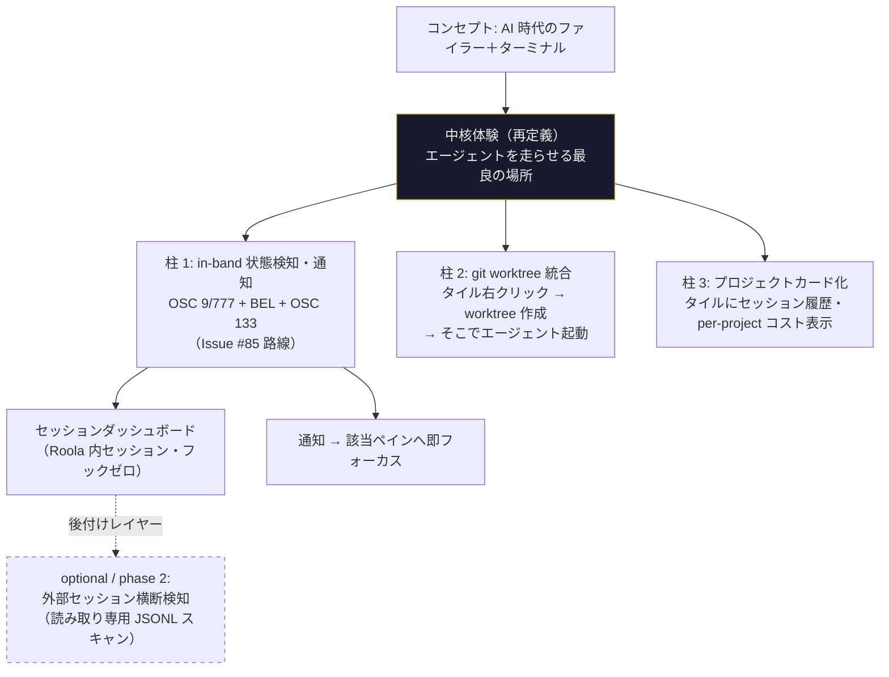
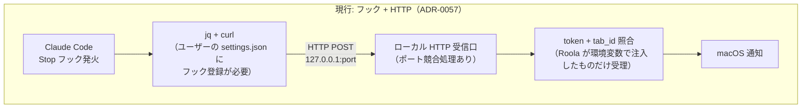
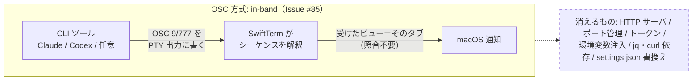
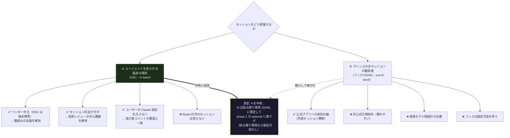
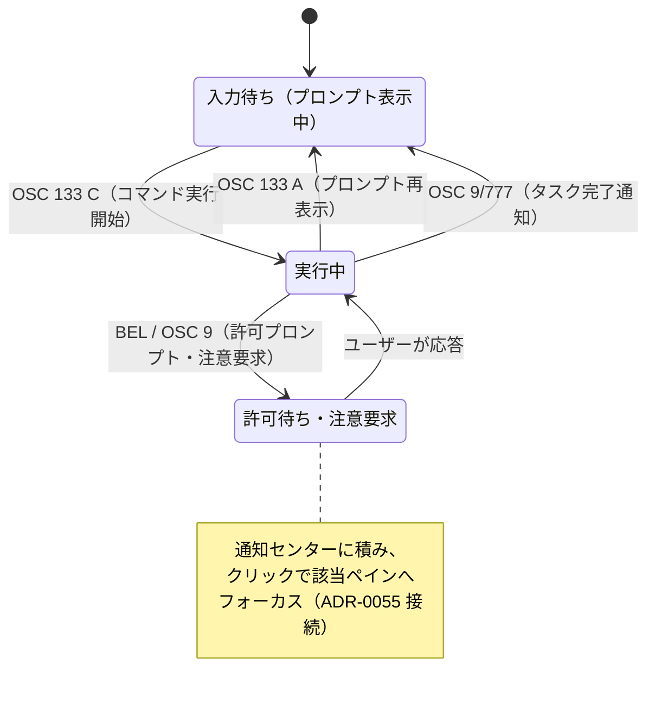
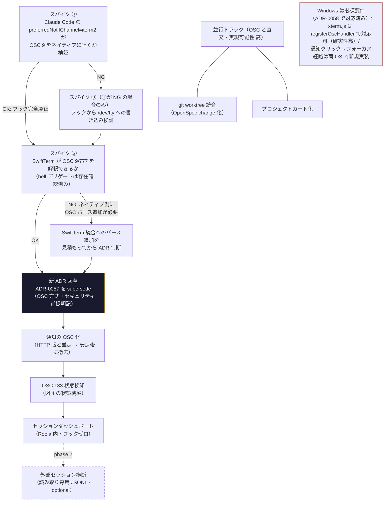
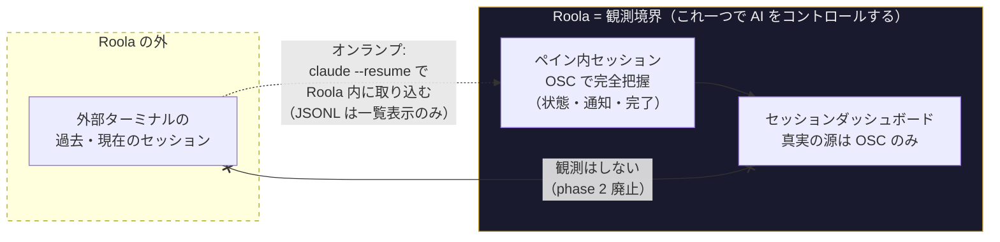

# コンセプト評価と今後の機能方針（2026-06-11）

> **位置付け**: 決定前の構想メモ。ADR（決定の記録）・OpenSpec change（実装単位）の前段階。
> ここから固まったものを ADR / change に昇格させる。

## テーマ

Roola のコンセプト「AI 時代のファイラー＋ターミナル」への評価と、今後の機能開発の方向性。

## コンセプト評価

### 強み（方向は正しい）

- **タイミング**: コーディングエージェントの普及で開発の重心がエディタからターミナルへ回帰。エージェントは「ディレクトリ」を作業単位として動くため、AI 時代の開発者の作業面は「ファイルシステム × ターミナルセッション × エージェント」の三つ組。これを 1 画面に束ねる構えは理にかなっている。
- **ポジション**: Warp / Ghostty はターミナル単体、Finder 系ファイラーは AI と無関係、IDE はエディタ中心。「ファイラーを主役に据えてエージェントを従える」角度はほぼ空白地帯。
- **ピボットの健全性**: ADR-0014〜0016 で「Claude Skill ランチャー → 汎用ターミナルランチャー → Explorer 主役」と段階的に転換し、ADR-0022 で Claude 機能を optional 化。特定ベンダー依存を避けつつ土台を汎用に保てている。
- Polaris（ADR-0038）による独自の見た目はツール系プロダクトとしての記憶されやすさに寄与。

### ギャップ（「AI 時代の」がまだ薄い）

- 現状の AI 連携は Skill ワンクリック起動（ADR-0062）・Stop フック通知（ADR-0057）・使用量メーター（ADR-0060）で、いずれも**周辺の便利機能**。
- AI を全部取り除いても成立する「良くできたファイラー＋ターミナル」であり、コンセプトを体現する**中核体験がまだ無い**。ここがコンセプトと実装の最大の乖離。

### 競合環境

- 「エージェントセッション管理」カテゴリ（Conductor / Crystal / claude-squad 等）が急速に混雑中。
- Roola は彼らに無い「ファイラーが主役」という土台を持つ。追いかけるのではなく、この土台の上にセッション管理を載せるのが勝ち筋。

## 提案：「ディレクトリ＝エージェントの作業単位」を中核体験にする

既存インフラ（Stop フック受信口・FSEvents 監視・Git ビュー・プレビューパネル・使用量集計）が土台になるものを優先。

### 第 1 優先：エージェントセッションのミッションコントロール

1. **セッションダッシュボード**
   - マシン上の複数 Claude Code セッションを「どのディレクトリで・実行中／入力待ち／完了」の状態付きで一覧表示。
   - ADR-0057 のフック受信口を拡張すれば状態検知の大半は実現可能。
   - これが入った瞬間に「AI 時代のファイラー」が名実ともに揃う。最優先。
2. **入力待ち・許可待ちの通知センター化**
   - 完了通知だけでなく「許可を求めて止まっている」を検知し、クリックで該当ペインへフォーカス（ADR-0055 のフォーカス復元と接続）。
   - 並列セッション運用の最大のペインポイント。

### 第 2 優先：ファイラー側をエージェント文脈で強化

3. **git worktree 統合**
   - 並列エージェントの標準作法は worktree。タイル右クリックから「worktree を切ってそこでエージェント起動」、worktree 一覧とブランチ・diff 状態の表示。
   - Git ビュー（ADR-0030）の自然な拡張。ファイラー主役の構えが最も活きる。
4. **エージェントによる変更の可視化**
   - FSEvents 監視（ADR-0041）＋既存プレビュー（ADR-0046/0050/0061）で「エージェントが今このファイルを変えた」を一覧上でハイライトし、プレビューで diff 表示。
   - エージェントの仕事を目視で監督する体験はファイラーにしか作れない。
5. **ディレクトリのプロジェクトカード化**
   - タイルに CLAUDE.md の有無・最近のセッション履歴・プロジェクト別使用コスト（ADR-0060 の集計を per-project に分解）を表示。
   - `~/.claude/projects` の JSONL を読めば実装可能。トランスクリプトのプレビュー＋ `claude --resume` での復帰導線まで伸ばせる。

### 第 3 優先（抑制の提案）

- ノートパッド・アクティビティモニタ系のような**横方向の便利機能の追加は一旦停止**。単独開発で機能面積がすでに広く、これ以上広げるとコンセプトの輪郭がぼやける。
- スローガン「目的地へ、一瞬で。」の AI 時代の読み替えは「**エージェントの現場へ、一瞬で。**」。上記 1〜5 はすべてこの一本線上にある。
- Windows 対応（進行中）は市場を倍にするので継続価値ありだが、セッションダッシュボードより先にやる理由は無い。

---

## マルチエージェントレビュー結果（2026-06-11 追記）

上記の提案を 3 観点（懐疑派・市場検証・技術実現性）の独立エージェントでレビューした結果。
**上記本文には事実誤認・楽観が複数含まれる**。本文は議論の記録として残し、修正はここに集約する。

### 事実誤認（市場検証で判明）

- **「Warp / Ghostty はターミナル単体」は古い**: Warp はファイルツリー・エージェント管理パネル・コードレビューを備えた ADE（Agentic Development Environment）に進化済み。Roola の最も近い競合の一つ。
- **Crystal は 2026-02 に終了し Nimbalyst へ移行済み**。競合リストには最大手の Vibe Kanban（27k stars）・Omnara（許可待ちプッシュ通知が中核）・Sculptor を加えるべき。
- **最重要の欠落**: **Claude Code 公式デスクトップアプリが 2026-04 に並列セッション中心へ全面再設計済み**。セッションサイドバー（状態フィルタ・プロジェクト別グルーピング）・セッション毎の自動 worktree・diff ビュー・統合ターミナル・完了通知・スマホ Dispatch（承認プッシュ通知）まで搭載。**第 1 優先「セッションダッシュボード」を素朴に作ると公式無料アプリの劣化版になる**。
- 「Finder 系ファイラーは AI と無関係」も不正確（Filer 等の AI ファイラーは存在）。ただし「開発者向けコーディングエージェント × ファイラー」は依然未確認で、限定された空白は残る。

### 公式アプリに対して残る差別化軸（市場検証）

1. **アプリ外（他ターミナル）で起動されたセッションも含むマシン横断検知** — 既存プロダクトはすべて「自アプリ内で起動したセッション」のみ管理
2. **マルチベンダー対応の余地**（Codex / Gemini CLI 等）— ADR-0022 のベンダー非依存土台が対公式の防御線
3. **ファイル一覧上のリアルタイム変更ハイライト**（ファイラー起点の見せ方）— 既存はすべてセッション/タスク起点の diff
4. 通知 → 該当ローカルペインへ即フォーカス（ADR-0055 接続）というデスクトップ内動線

### 技術実現性の検証結果

| 機能 | 実現可能性 | 主なギャップ |
|---|---|---|
| 1. セッションダッシュボード | 中〜高 | フック仕様上、状態検知は全て可能（UserPromptSubmit / Notification(permission_prompt) / PermissionRequest / Stop / SessionStart・End）。ただし現受信口は token/tab_id 必須で「Roola 起動セッションのみ受理」— 受理モデルの再設計＋既存セッション補完の JSONL スキャン併設が必須。「受信口を拡張すれば大半は実現可能」は楽観 |
| 2. 通知センター化 | 中 | 検知は可能。通知クリック→フォーカスのネイティブ経路（macOS didReceive / Windows WM_ACTIVATE + onClick）が両 OS で丸ごと新規 |
| 3. git worktree 統合 | **高** | `process_git_repository.dart` への worktree コマンド追加は既存構造の自然な延長。git CLI 経由で Windows もそのまま動く |
| 4. 変更可視化 | 中 | `DirectoryWatcher` は意図的にイベント詳細を捨てている（要・別系統 watcher）。「エージェントが変えた」の帰属は FS イベント単独では不可能 — PostToolUse フックとの突合が筋 |
| 5. プロジェクトカード化 | **高** | cc_usage の集計ループは既にファイルパスを持つ。encoded path の不可逆性（cwd フィールドで突合）と累計集計の性能だけ設計が要る |

### 懐疑派の主要な反論

- 中核体験を Claude Code の非公式内部仕様（フック・JSONL）に賭けるのは、ADR-0016/0022 のベンダー非依存方針への逆走。周辺機能が壊れるのは許容できても中核が他社非公式仕様の上に建つのは構造的に脆い
- 「ファイラーが主役」がユーザー価値だという論証が無い。エージェントがファイル操作を代行するほど人間がファイルツリーを見る時間は減る、という逆方向の解釈も成り立つ
- 「これが入った瞬間に名実が揃う」「最大のペインポイント」等はデータ無しの断言（Aptabase 導入直後で利用データ未取得）
- Windows 対応継続＋新機能 5 件は個人開発として過積載。どちらかを明示的に「やらない」と決めるべき
- 妥当と認められた点: 「横方向の機能追加停止」「中核体験が無いという自己診断」「既存資産から積む方法論」「notes → ADR → change の昇格プロセス」

### レビューを踏まえた優先順位の改訂案

1. **先に小さく**: 許可待ち・入力待ち通知の強化（提案 2 の縮小版）＋ **git worktree 統合（提案 3・実現可能性高・ファイラー動線が活きる）** を先行し、需要を測る
2. セッションダッシュボード（提案 1）は「公式アプリと正面衝突しない条件」= 外部起動セッション横断検知・マルチベンダー拡張可能性を**要件に明記してから** change に起こす。設計の中心課題はイベント検知ではなく**セッション同定とライフサイクル管理**
3. 提案 5（プロジェクトカード化）は低リスクで独自性も中程度 — 1 と並行可
4. 提案 4（変更可視化）は「ファイル一覧上のリアルタイムハイライト」に絞れば独自性が立つが、帰属判定はフック受信口の再設計（= 2 の後）に依存

---

## Issue #85（通知 OSC 方式）を踏まえた再検討（2026-06-11 追記）

[Issue #85](https://github.com/yahir0/Roola/issues/85)「タスク完了通知を通知エスケープシーケンス（OSC）方式に置き換える」（ADR-0057 関連）と
協力者コメント（**Claude Code にフックさせること自体をやめたい** — ①フックでは Stop 以外の検知が貧弱
②ユーザーの Claude Code 設定にターミナル由来の設定が混入して煩雑）を確認した。

### 結論: OSC 方式は上記レビューの 2 大反論を同時に解消する

前節のレビューで指摘された問題と、OSC 方式の対応関係:

| レビューの指摘 | OSC 方式での帰結 |
|---|---|
| 懐疑派: 中核体験を Claude の非公式フック/JSONL 仕様に賭けるのはベンダー非依存方針（ADR-0016/0022）への逆走 | **解消**。OSC 9/777/99 はターミナル標準の in-band チャネル。Codex / Gemini CLI / 任意のスクリプトも同じ経路で通知でき、ベンダー中立 |
| 技術レビュー: 設計の中心課題は「セッション同定とライフサイクル管理」（token/env 注入/ポート/HTTP の受理モデル再設計が必要） | **解消**。in-band なので「シーケンスを受けた SwiftTerm ビュー = そのセッション」。同定レイヤーが丸ごと消える（Issue #85 本文の主張どおり） |
| 市場レビュー: 公式デスクトップとの差別化は「外部起動セッションの横断検知」 | **トレードオフ**。OSC は Roola ペイン内のセッションしか見えない。外部横断はフック/JSONL でしか実現できない |

### 戦略の再フレーミング

OSC 採用は単なる通知実装の差し替えではなく、**プロダクトの立ち位置の選択**になる:

- **A. 「エージェントを走らせる最良の場所」**（OSC 路線）: Roola ペイン内のセッションを in-band 信号で
  完全把握する。堅牢・ベンダー中立・ユーザーの Claude 設定を汚さない。
- **B. 「マシン上の全セッションの観測者」**（フック/JSONL 路線）: 公式アプリに対する差別化軸だが、
  非公式仕様依存・受理モデル再設計・設定汚染のコストを払う。

**A を中核に据え、B は読み取り専用 JSONL スキャンに限定した後付けレイヤーに格下げする**のが妥当。
理由: (1) 協力者の問題意識（設定汚染）は A で解消し B のフック部分とだけ衝突する。読み取り専用の
JSONL スキャンなら設定汚染は起きない。(2) 中核が壊れにくい方が個人開発の保守に合う。
(3) 市場レビューの差別化軸のうち「マルチベンダー対応」は A の方がむしろ強い。

### 状態検知の OSC 拡張（ダッシュボードへの道筋）

通知（OSC 9/777）に留めず、**OSC 133（semantic prompt / shell integration マーク）**まで拾えば
「プロンプト待ち ⇄ コマンド実行中」の状態がツール非依存・フック不要で取れる。これが
ペイン単位の「実行中／入力待ち」状態源になり、セッションダッシュボード（Roola 内分）は
フックゼロで成立する。`TerminalPlatformView.swift:251` に `bell()` デリゲートが既に空実装で
存在しており、BEL（許可待ち時のベル）の受信面は実質できている。

### Issue #85 の不確実性への補足

- 不確実性 (1)「フックが PTY に書き込めるか」より先に検証すべきこと: **Claude Code の
  `preferredNotifChannel` 設定（`iterm2` / `terminal_bell` 等）が OSC 9 / BEL をネイティブに
  吐くか**。これが使えればフック自体が不要になり、協力者コメントの主目的がそのまま達成される
  （`/dev/tty` 書き込み検証はフォールバック扱いに格下げできる）。
- 不確実性 (2)「SwiftTerm が通知 OSC を解釈するか」は要調査のまま。ただし bell デリゲートの
  存在からネイティブ側の受信面の足場はある。
- **Windows は必須要件**（ADR-0058 で対応済みプラットフォーム）: macOS は SwiftTerm の
  OSC 解釈可否が要調査だが、Windows のレンダラ xterm.js には `registerOscHandler` という
  公開 API があり OSC 対応は確実性が高い。詳細は後述「OSC の仕組み解説」の Windows 節。
- セキュリティ（`cat` による偽通知注入）は Issue 記載のとおり dev ツールとして許容。ADR に明記。

---

## OSC の仕組み解説 — なぜこれで全部が簡単になるのか（2026-06-11 追記）

### ターミナルの出力は「文字」だけではない

CLI プログラムの出力は、PTY（擬似端末）を通る **1 本のバイトストリーム**として
ターミナル（Roola のペイン）に届く。このストリームには画面に見える文字だけでなく、
**見えない制御命令（エスケープシーケンス）**が混ざっている。ターミナルは VT100 の時代から
このストリームを常時パースし、制御命令を「描画せずに実行」してきた。
`ls` の色付き出力が色付きで見えるのは、まさにこの仕組み（SGR シーケンス）が動いているから。

**OSC（Operating System Command）**はこの制御命令の一族で、`ESC ]` + 番号 + パラメータの形を取る。
番号ごとに意味が決まっており、どれも日常的に使われている枯れた仕組み:

| シーケンス | 意味 | 身近な例 |
|---|---|---|
| OSC 0 | ウィンドウタイトル変更 | シェルが cwd をタブ名に出すのはこれ |
| OSC 8 | ハイパーリンク | `ls` の出力がクリックできるターミナルはこれ |
| OSC 52 | クリップボード書き込み | リモートの vim から手元にコピーできるのはこれ |
| **OSC 9 / 777 / 99** | **デスクトップ通知** | iTerm2 / kitty / WezTerm / **Windows Terminal** が対応 |
| **OSC 133** | プロンプト/コマンドの境界マーク | shell integration（実行中か入力待ちかの判別） |

つまり「通知エスケープシーケンス」とは、**プログラムが画面に見えない 1 行を印字すると、
ターミナルがそれを通知として OS に中継してくれる**という、既存ターミナル界の標準プロトコル。

```mermaid
sequenceDiagram
    participant CLI as CLI ツール（claude / codex / 任意）
    participant PTY as PTY（1 本のバイトストリーム）
    participant Pane as Roola のペイン<br/>（macOS: SwiftTerm / Windows: xterm.js）
    participant OS as OS 通知

    CLI->>PTY: 「ビルド中...」（見える文字）
    PTY->>Pane: 同じストリーム
    Pane->>Pane: 画面に描画
    CLI->>PTY: ESC ] 9 ; タスク完了 BEL（見えない制御列）
    PTY->>Pane: 同じストリーム
    Pane->>Pane: パーサが OSC 9 を検出（描画しない）
    Pane->>OS: 通知を表示<br/>送信元 = このペイン（照合不要）
```

### 導入で何が嬉しいか

1. **「どのセッションからの通知か」の照合が構造的に不要になる**。
   信号がペインの読んでいるストリームそのものに乗ってくる（in-band）ので、
   受け取ったペイン = 送信元。現行方式が払っているコスト —
   HTTP サーバ・ポート管理・トークン・環境変数注入・settings.json へのフック登録 — は
   すべて「別経路（out-of-band）で届いた信号の出所確認」のためのものであり、丸ごと消える。
2. **ベンダー中立**。OSC はターミナルの標準であって Claude の仕様ではない。
   claude でも codex でも自作スクリプトでも `printf` 一発で通知が出せる。
   1 つの実装で「AI をコントロールする」対象すべてをカバーできる。
3. **ユーザー設定がゼロになりうる**。Claude Code には `preferredNotifChannel=iterm2` という
   標準設定があり、これが OSC 9 をネイティブに吐くなら、フックの登録すら不要（要スパイク検証）。
4. **既存エコシステムへの相乗り**。iTerm2 / kitty / WezTerm / Windows Terminal と同じ土俵に
   立つので、OSC 通知を吐くツールが増えるほど Roola が勝手に対応済みになる。
5. **同じ仕組みの延長で状態検知まで届く**（OSC 133 → 図 4 の状態機械）。通知と状態把握が
   1 つのパース基盤に乗る。

トレードオフは既述のとおり: in-band ゆえに、当該バイト列を含むファイルを `cat` しただけでも
通知が飛びうる（エスケープシーケンス注入）。iTerm2 等と同じ前提で dev ツールとして許容し、ADR に明記する。

### Windows の位置付け訂正 — 「将来」ではなく対応済みの一級プラットフォーム

本ノートの旧記述（「Windows 並行確認」「windows-platform-support change 進行中」）は不正確。
**ADR-0058 で対応プラットフォームは macOS + Windows に拡張済み**であり、OSC 方式の検討は
最初から両 OS を必須要件として扱う。

実装面ではむしろ朗報: Windows のターミナルレンダラは **xterm.js**（ADR-0058 D1、
`assets/js/xterm/`）で、xterm.js には `registerOscHandler(番号, コールバック)` という
**公開 API が最初から存在する**。OSC 9/777 の追加はドキュメント化された拡張点であり、
SwiftTerm 側（解釈可否が要調査）より確実性が高い。スパイクは両 OS で実施し、
通知表示（Windows は `local_notifier`）とクリック→フォーカス経路も両 OS 分を設計に含める。

## 図解（2026-06-11 追記）

ここまでの議論（初版提案 → 3 観点レビュー → Issue #85 反映）を 5 枚の図に圧縮する。

### 図 1: 方針の全体像 — どこで勝負するか

「AI 時代のファイラー＋ターミナル」の中核体験を **「エージェントを走らせる最良の場所」** に定める。
公式デスクトップアプリと正面衝突する「全部入りダッシュボード」は避け、ファイラー＋ターミナルの土台が活きる機能に絞る。



### 図 2: 通知経路の比較 — 現行（ADR-0057）vs OSC 方式（Issue #85）

現行方式の複雑さの大半は「どのセッションからの通知か」を**帯域外（out-of-band）**で照合していることに由来する。
OSC 方式は信号がターミナル出力そのもの（in-band）に乗るため、**受けたビュー＝そのセッション**となり照合レイヤーが丸ごと消える。





### 図 3: 立ち位置の選択 — なぜ A 路線を中核にするか

OSC 採用は通知実装の差し替えではなく**プロダクトの立ち位置の選択**。レビューで出た反論との対応はこうなる。



### 図 4: ペイン単位の状態検知 — ダッシュボードの状態源

通知（OSC 9/777）だけでなく **OSC 133（shell integration マーク）** まで拾うと、ペインごとの状態機械が
フックなし・ツール非依存で回る。これが「Roola 内セッションダッシュボード」の状態源になる。



### 図 5: ロードマップ — 何をどの順でやるか

スパイクの結果で分岐する。**検証が済むまで現行 HTTP 版（#83）は外さない**（Issue #85 の方針どおり）。



---

## スコープ判断: アプリ外セッションはそもそも想定しない（2026-06-11 追記）

オーナーの指摘: Roola は「**これ一つで AI をコントロールする**」ことを主眼に置いている。
であれば、OSC の「アプリ外の通知が受け取れない」という課題は、**アプリ外を管理対象にしない**という
スコープ定義で解決できるのではないか。

### 判断: 採用する。phase 2（外部セッション観測）は「格下げ」ではなく「廃止」

この整理は成立する。理由:

1. **製品の契約が明快になる**: 「Roola で走らせたものは Roola が完全に把握する」。
   観測境界 = アプリ境界という 1 行で説明できる。外部観測を残すと、OSC 由来の高精度な状態と
   JSONL 推定の低精度な状態が 1 つのダッシュボードに混在し、真実の源が 2 つになる
   （技術レビューが指摘した「セッション同定とライフサイクル管理」の複雑さが裏口から戻ってくる）。
2. **非公式仕様依存が完全に消える**: phase 2 は懐疑派レビューが指摘した「壊れやすい部分」の
   最後の残置だった。廃止すれば中核〜周辺まで全てが標準技術（OSC・git CLI・PTY）の上に乗る。
3. **既存の設計判断とも整合**: ADR-0042（終了時ワークスペース破棄・起動は既定 seed）など、
   Roola は元々「Roola から始める」前提の設計を積んでいる。
4. **差別化軸の置き直し**: 市場レビューは「外部セッション横断検知が公式アプリへの差別化」としたが、
   これは観測範囲での差別化。代わりに**ワークフローの起点での差別化**に置き直す —
   公式アプリは「セッション一覧が起点」、Roola は「**ディレクトリ／ファイルが起点**」
   （タイルから worktree を切って起動、ファイル一覧上の変更ハイライト、フォルダ＝プロジェクトカード）。
   この軸なら観測範囲を広げなくても成立する。

### 正直に認識しておくべきコスト

**導入導線（オンボーディング）が重くなる**。開発者は既に他のターミナルでエージェントを走らせる習慣を
持っており、「Roola 内で起動したものしか見えない」なら、ワークフローを Roola に移すまで
ダッシュボードは空のままになる。外部観測は「乗り換え前に価値が見える」橋でもあった。

**緩和策**: 観測ではなく**取り込み（オンランプ）**を用意する。`~/.claude/projects` の JSONL を
「外部セッションの監視」には使わず、**過去セッションの一覧表示と `claude --resume <id>` での
Roola 内再開**にだけ使う（読み取り専用・一覧のみ・状態推定なし）。
「外で始めた仕事を Roola に持ち込む」導線であり、観測境界の原則とは矛盾しない。



この判断は確定したら **ADR 化する価値がある**（「Roola 内起動セッションのみを管理対象とする」
というスコープ原則。OSC 方式 ADR と同時か、その一部として記載）。

---

## スパイク結果（2026-06-11 実施）

Issue #85 の不確実性 (1)(2) ＋ 本ノートのスパイク①〜③を実機・実ソースで検証した。

### ② 受信側 — 両 OS とも検証完了 ✅

**macOS（SwiftTerm）: 想定以上に良い。OSC 777 通知は組み込み済みだった。**

- `EscapeSequenceParser.swift:542` に `case 777: terminal.oscNotification(data)` が存在し、
  `ESC ] 777 ; notify ; title ; body BEL` をパースして
  **`TerminalDelegate.notify(source:title:body:)` を呼ぶ実装が SwiftTerm に最初から入っている**
  （`Terminal.swift:1829`）。Roola 側は `RoolaTerminalView`（既に `TerminalViewDelegate` 実装、
  `bell()` は空実装あり）に `notify` を実装するだけ。
- OSC 9 は素の通知としては未対応（`9;4` の ConEmu 進捗レポートのみ組み込み。
  ついでに `progressReport` デリゲートも存在し、将来の進捗 UI に使える）。
  ただし **`registerOscHandler(code:handler:)` という公開 API があり、登録ハンドラは
  組み込み switch より優先される**ため、OSC 9 / OSC 133 の追加は数行で可能。
- Issue #85 の不確実性 (2)「SwiftTerm が通知 OSC を解釈するか」は **解消（777 はネイティブ、9/133 は公開 API で追加）**。

**Windows（xterm.js）: 同梱バンドルに `registerOscHandler` あり ✅**

- `assets/js/xterm/xterm.js`（ADR-0058 D1 の同梱レンダラ）に `registerOscHandler` を確認。
  ドキュメント化された公開 API で OSC 9/777/133 すべて登録可能。

### ① 送信側（Claude Code）— **実機検証済み ✅ ベストケース成立**

**実機キャプチャで OSC 9 の出力を確認した（2026-06-11・claude 2.1.173）:**

```
検証方法: PTY（script コマンド）上で TERM_PROGRAM=iTerm.app を注入して claude を起動し、
         許可プロンプト発生時の生出力バイトをキャプチャ
前提:    preferredNotifChannel は未設定（= auto）。ユーザー側の設定変更は一切なし
結果:    ESC ] 9 ; Claude needs your permission BEL  ← OSC 9 を確認
```

**つまり「ユーザー設定ゼロ + フックゼロ」での通知が成立する。** 注意点が 1 つ:
claude はフォーカストラッキング（CSI ?1004h を有効化し FocusIn/FocusOut を受信）で
「ターミナルがフォーカス中なら通知を抑制」する。検証でも FocusOut（`ESC [ O`）を
注入した場合のみ発火した。**Roola 側はペインのフォーカス状態を CSI I / CSI O として
PTY に転送する必要がある**（SwiftTerm のフォーカスレポーティング対応を実装時に確認）。
これは正しい動作（見ている画面には通知不要）であり、設計に織り込む。

静的解析からの裏付け:

claude 2.1.173 のバイナリ（bun 埋め込み JS ソース）から確認できたこと:

- `preferredNotifChannel` は現行も有効（zod スキーマに "Preferred OS notification channel"）。
- チャネルディスパッチの実体:
  `case "iterm2": notifyITerm2(...)` / `iterm2_with_bell` / `terminal_bell` /
  `notifications_disabled` に加え、**`kitty`（OSC 99）と `ghostty` のチャネルが存在**。
- **`auto` モードは `switch (env.TERM_PROGRAM)` で判定**:
  `case "iTerm.app" → notifyITerm2` / `case "kitty"` / `case "ghostty"` / `default → no_method_available`。
- 環境変数注入は Roola が既にやっている手法（ADR-0057 の `ROOLA_TAB_ID`）であり、
  自分の子プロセス限定なので設定汚染にも当たらない。
- **設計メモ**: `auto` の判定はキャッシュ値優先（`fj()?.terminal ?? ...`）の形跡があるため、
  `TERM_PROGRAM=iTerm.app` 注入が最も確実（実機検証済みの組み合わせ）。
  ghostty チャネル（OSC 777 系・SwiftTerm ネイティブ対応と一致）も選択肢だが、
  emit されるシーケンスの実機確認は未実施。実装時は検証済みの iTerm.app/OSC 9 を既定とし、
  受信側は OSC 9 と 777 の両対応にしておくのが安全。

### ③ `/dev/tty` フォールバック — 不要が確定

①が実機で成立したため不要。Issue #85 の不確実性 (1) は検証対象から外れた。

### スパイク総括: **全項目クリア。OSC 方式は採用可能**

| 項目 | 結果 |
|---|---|
| ① Claude Code が OSC 9 を吐くか | ✅ 実機確認（TERM_PROGRAM 注入のみ・ユーザー設定ゼロ） |
| ②a SwiftTerm の OSC 解釈 | ✅ OSC 777 はネイティブ、OSC 9/133 は公開 API で追加可 |
| ②b xterm.js（Windows）の OSC 解釈 | ✅ `registerOscHandler` 公開 API を同梱バンドルで確認 |
| ③ /dev/tty フォールバック | 不要（①成立のため） |

残る実装課題: フォーカス状態の PTY 転送（CSI I/O）・通知クリック→ペインフォーカスの
ネイティブ経路（両 OS）・HTTP 版との並走と撤去タイミング。
Issue #85 の「進め方の案」ステップ 2 のとおり、**新 ADR で ADR-0057 を supersede する段階に進める**。

## 次のアクション（Issue #85 反映で再改訂）

- [x] **スパイク（Issue #85 拡張版）**: 完了（上記「スパイク結果」参照）。① OSC 9 実機確認 ✅
  ② SwiftTerm（777 ネイティブ + registerOscHandler）/ xterm.js（registerOscHandler）✅ ③ 不要が確定
  - [ ] 残: Windows 実機での送信側確認（macOS で検証済みのため低リスク・実装時に確認）
- [x] 新 ADR で ADR-0057 を supersede → **ADR-0066 起草済み**（OSC 方式・フック廃止・スコープ原則・セキュリティ前提を明記）
- [ ] OSC 通知の実装を OpenSpec change として起こす（ADR-0066 の Decision 1〜5・7 が要件の骨子）
- [ ] OSC 133 による実行中／入力待ち検知は別 ADR で検討（ダッシュボードの状態源・ADR-0066 の Why に布石あり）
- [ ] git worktree 統合を OpenSpec change として起こす（優先度不変・OSC とは直交）
- [ ] ~~外部セッション横断検知（読み取り専用 JSONL スキャン）は phase 2 の optional に格下げ~~
  → **廃止**（スコープ判断節を参照）。代わりにオンランプ（過去セッション一覧 + `claude --resume` 取り込み）を検討
- [x] スコープ原則「Roola 内起動セッションのみを管理対象とする」を OSC 方式 ADR に含めて明文化 → ADR-0066 Decision 6
- [ ] 通知クリック→ペインフォーカスのネイティブ経路（macOS didReceive / Windows onClick）は OSC 化後も必要

## ステータス

- 2026-06-11: 初版。議論のみ、未着手。
- 2026-06-11: 3 観点のエージェントレビューを実施し結果を追記。優先順位を改訂（worktree 統合＋通知強化を先行、ダッシュボードは要件再定義後）。
- 2026-06-11: Issue #85（OSC 通知方式・フック廃止提案）を反映して再検討。OSC 路線を中核に採用する方向へ再改訂（フック/JSONL は optional レイヤーに格下げ）。
- 2026-06-11: 方針全体を 5 枚の Mermaid 図（全体像・通知経路比較・立ち位置選択・状態機械・ロードマップ）で図解化。
- 2026-06-11: スコープ判断を追加 —「これ一つで AI をコントロールする」を主眼とし、アプリ外セッションの観測は**廃止**（phase 2 取りやめ）。緩和策としてオンランプ（`claude --resume` 取り込み）を検討。図 1・3・5 の「phase 2（点線）」はこの判断により読み替えること。
- 2026-06-11: OSC の仕組み解説を追加。あわせて Windows の位置付けを訂正 —「将来・並行確認」ではなく **ADR-0058 で対応済みの一級プラットフォーム**として、スパイク・実装とも両 OS を必須要件に変更（Windows の xterm.js は `registerOscHandler` 公開 API があり対応の確実性はむしろ高い）。
- 2026-06-11: **スパイク完了・全項目クリア**。Claude Code の OSC 9 出力を実機キャプチャで確認（`ESC ] 9 ; Claude needs your permission BEL`・TERM_PROGRAM 注入のみ・ユーザー設定ゼロ）。SwiftTerm は OSC 777 ネイティブ対応＋公開 registerOscHandler、xterm.js も同 API を確認。次は ADR-0057 を supersede する新 ADR の起草へ。
- 2026-06-11: **ADR-0066 起草**（OSC 方式・フック廃止・スコープ原則・フォーカス転送・両 OS 対称実装・HTTP 版との並走方針）。ADR-0057 を Superseded に更新、CLAUDE.md の ADR リストに追記。残りは OpenSpec change 化と実装。
- 2026-06-11: **OpenSpec change `osc-task-notification` を作成し実装ほぼ完了**（22 タスク中 19 完了）。TERM_PROGRAM 注入・SwiftTerm/xterm.js の OSC 9/777 受信・Dart 通知ポリシー層（フォーカス破棄/レート制限/フック経路との重複抑止）・通知クリック→ペインフォーカス復帰（両 OS）。analyze/test/build すべてグリーン。残: GUI での手動シナリオ確認（tasks 6.1）・Windows 実機確認（3.1）・確認後の Issue #85 クローズ（6.3）。
  - 実装で判明: SwiftTerm / xterm.js とも mode 1004（フォーカスレポーティング）は組み込み対応で、CSI I/O の自前実装は不要だった。SwiftTerm の `TerminalViewDelegate` に notify は転送されないため OSC 777 も `registerOscHandler` 明示登録で受けた。
- 2026-06-11: オーナー実機確認で **通知意味論の差が顕在化** — claude ネイティブ通知は「許可待ち（即時）」と「入力待ちアイドル（`messageIdleNotifThresholdMs` 既定 60 秒）」のみで、**「完了の瞬間」の通知は存在しない**。オーナー判断: 既定は 60 秒アイドル通知で良し、**フック経路（ADR-0057）は即時完了通知のオプションとして正式存続**（「安定後に撤去」を撤回）。D5 の重複抑止は別イベントの混同だったため撤廃。ADR-0066/0057・design・spec を改訂済み。
